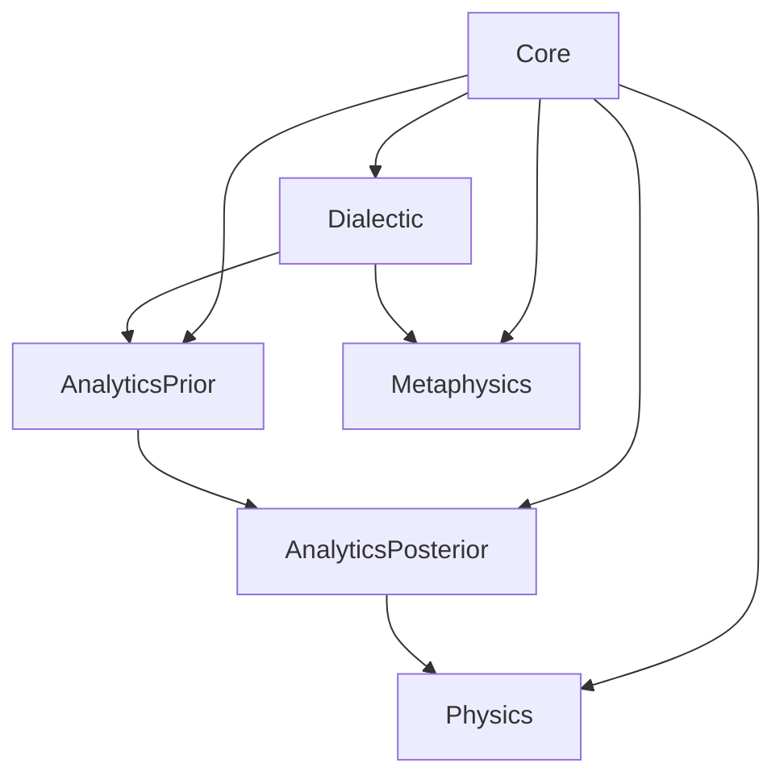

# Aristotle Refactor Plan

## Review Verdict

- The current Aristotle folder is not yet a coherent PhiLib kernel. It behaves as three partially overlapping branches: `[Philosophy/Aristotle/Basic.lean](Philosophy/Aristotle/Basic.lean)` plus `[Philosophy/Aristotle/SensesOfBeing.lean](Philosophy/Aristotle/SensesOfBeing.lean)`, the stronger logic spine `[Philosophy/Aristotle/Categories.lean](Philosophy/Aristotle/Categories.lean)` -> `[Philosophy/Aristotle/PriorAnalytics/Syntax.lean](Philosophy/Aristotle/PriorAnalytics/Syntax.lean)` -> `[Philosophy/Aristotle/PriorAnalytics/ProofTheory.lean](Philosophy/Aristotle/PriorAnalytics/ProofTheory.lean)` -> `[Philosophy/Aristotle/PosteriorAnalytics/Core.lean](Philosophy/Aristotle/PosteriorAnalytics/Core.lean)` -> `[Philosophy/Aristotle/Dialectic.lean](Philosophy/Aristotle/Dialectic.lean)`, and a separate physics branch `[Philosophy/Aristotle/PhysicsI.lean](Philosophy/Aristotle/PhysicsI.lean)` plus `[Philosophy/Aristotle/PhysicsI_Principles.lean](Philosophy/Aristotle/PhysicsI_Principles.lean)` plus `[Philosophy/Aristotle/PhysicsII_Causes.lean](Philosophy/Aristotle/PhysicsII_Causes.lean)`.
- The main problem is not syntax or linting; it is architectural and semantic drift. The notes in `[Philosophy/Aristotle/MDC_Menn.md](Philosophy/Aristotle/MDC_Menn.md)`, `[Philosophy/Aristotle/AOMSB1.md](Philosophy/Aristotle/AOMSB1.md)`, `[Philosophy/Aristotle/Path to Principles.md](Philosophy/Aristotle/Path%20to%20Principles.md)`, and the `R.Smith*.md` corpus describe a connected program that the current Lean APIs only partially realize.

## Highest-Risk Defects

- Menn fidelity is flattened in `[Philosophy/Aristotle/Categories.lean](Philosophy/Aristotle/Categories.lean)`: `genusCandidate := eligibleForGenusOrDefinition genus ∧ sameCategory subject genus` turns one Topics presupposition into almost the whole genus workflow, even though `[Philosophy/Aristotle/MDC_Menn.md](Philosophy/Aristotle/MDC_Menn.md)` treats same-category as one check among several.
- The lexical/signification layer is too weak for Menn’s reconstruction. `[Philosophy/Aristotle/Categories.lean](Philosophy/Aristotle/Categories.lean)` uses `Term := { name : String }` plus `LexicalStatus : Term -> ...`, while `[Philosophy/Aristotle/Basic.lean](Philosophy/Aristotle/Basic.lean)` already sketches the more faithful expression/being/logos distinction.
- Smith fidelity is weakened in `[Philosophy/Aristotle/PosteriorAnalytics/Core.lean](Philosophy/Aristotle/PosteriorAnalytics/Core.lean)` by a global proposition-level notion `Immediate (prop)` with no science-relative subject matter. This cannot express Smith’s claims about unique foundational stocks within a science.
- `[Philosophy/Aristotle/PosteriorAnalytics/Semantics.lean](Philosophy/Aristotle/PosteriorAnalytics/Semantics.lean)` is too proposition-atomic: truth is assigned to whole categoricals and `DeductionSound` is postulated, so the code cannot derive Smith’s chain-based regress results from term structure.
- `[Philosophy/Aristotle/PriorAnalytics/Chains.lean](Philosophy/Aristotle/PriorAnalytics/Chains.lean)` and `[Philosophy/Aristotle/PriorAnalytics/Regress.lean](Philosophy/Aristotle/PriorAnalytics/Regress.lean)` honestly model finite route bookkeeping, but not the stronger anti-cycle, anti-triviality, and science-relative truth conditions in `[Philosophy/Aristotle/R.Smith - Aristotle's Regress Argument.md](Philosophy/Aristotle/R.Smith%20-%20Aristotle%27s%20Regress%20Argument.md)`.
- `[Philosophy/Aristotle/SensesOfBeing.lean](Philosophy/Aristotle/SensesOfBeing.lean)` misreads D7 as a flat enum. `[Philosophy/Aristotle/AOMSB1.md](Philosophy/Aristotle/AOMSB1.md)` treats potentiality/actuality as an axis cutting across categorial being and truth as an affection of thought, not just another peer sense attached to `B`.
- `[Philosophy/Aristotle/PhysicsI_Principles.lean](Philosophy/Aristotle/PhysicsI_Principles.lean)` and `[Philosophy/Aristotle/PhysicsI.lean](Philosophy/Aristotle/PhysicsI.lean)` duplicate `PathToPrinciples` and encode different readings. The `analysis : Whole -> Elements` API fits the rejected Reading A much better than the Reading B defended in `[Philosophy/Aristotle/Path to Principles.md](Philosophy/Aristotle/Path%20to%20Principles.md)`.
- `[Philosophy/Aristotle/PhysicsII_Causes.lean](Philosophy/Aristotle/PhysicsII_Causes.lean)` hard-codes global reduction of efficient/final to formal cause. That is a controversial thesis and should not be infrastructure.
- `[Philosophy/Aristotle/Dialectic.lean](Philosophy/Aristotle/Dialectic.lean)` has state-model drift: `availableEndoxa` is stored but not enforced by `askConcession`, and `Elenchus` takes an external thesis instead of reading `state.thesis`.

## Preserve

- Keep the main logical spine centered on `[Philosophy/Aristotle/Categories.lean](Philosophy/Aristotle/Categories.lean)` and the reuse of `Aristotle.Categories.Term` inside `[Philosophy/Aristotle/PriorAnalytics/Syntax.lean](Philosophy/Aristotle/PriorAnalytics/Syntax.lean)`.
- Keep the stage-indexed workflow instinct in `[Philosophy/Aristotle/Categories.lean](Philosophy/Aristotle/Categories.lean)` and `[Philosophy/Aristotle/Dialectic.lean](Philosophy/Aristotle/Dialectic.lean)`.
- Keep the honesty of scope comments in `[Philosophy/Aristotle/PriorAnalytics/Chains.lean](Philosophy/Aristotle/PriorAnalytics/Chains.lean)` and `[Philosophy/Aristotle/PriorAnalytics/Regress.lean](Philosophy/Aristotle/PriorAnalytics/Regress.lean)`.

## Target Architecture

- `Core`: one canonical vocabulary for expression, term, signified item, logos, predication, category, per-se/per-accidens, cause, and essence.
- `Dialectic`: antepredicamental screening, category placement, endoxa, genus/definition testing, and refutation workflow.
- `AnalyticsPrior`: categorical syntax, moods, figures, conversion, chains, and regress scaffolding.
- `AnalyticsPosterior`: science-relative immediacy, first principles, non-circularity, demonstration, and middle-as-cause.
- `Metaphysics` and `Physics`: domain modules built on the same core, not separate mini-foundations.

## Refactor Phases

1. Canonicalize the kernel.
  - Choose one authoritative core. Either absorb the useful abstractions from `[Philosophy/Aristotle/Basic.lean](Philosophy/Aristotle/Basic.lean)` into the main spine or delete that branch after extracting what survives review.
  - Add a public root module `[Philosophy/Aristotle.lean](Philosophy/Aristotle.lean)` and make `[Philosophy/Aristotle/PriorAnalytics.lean](Philosophy/Aristotle/PriorAnalytics.lean)` and `[Philosophy/Aristotle/PosteriorAnalytics.lean](Philosophy/Aristotle/PosteriorAnalytics.lean)` export their full intended APIs.
2. Rebuild the Menn layer over the new core.
  - Split expression, signified being, and logos into distinct types; move homonymy/paronymy/synonymy to relations rather than unary tags.
  - Replace the `sameCategory` shortcut with a staged record: antepredicamental admissibility -> categorial placement -> same-category compatibility -> idia/opposition/degree checks -> provisional dialectical genus.
  - Merge duplicated soul/harmony refutations in `[Philosophy/Aristotle/Basic.lean](Philosophy/Aristotle/Basic.lean)` and `[Philosophy/Aristotle/Dialectic.lean](Philosophy/Aristotle/Dialectic.lean)` into one reusable refutation pattern.
3. Rebuild the Smith layer around sciences rather than bare propositions.
  - Introduce `Science` or `DemonstrativeScience` with subject matter, admissible propositions, truth conditions, and foundational stock.
  - Redefine immediacy, first principles, and demonstration relative to a science.
  - Separate semantic chain models from proof-search routes; strengthen regress objects with no-dup, no-trivial-middle, anti-cycle, and science-relative truth invariants.
  - Move perfection and first-figure-companion material out of posterior core or make it an optional extension.
4. Repair metaphysics and physics as downstream domains.
  - Recode D7 in `[Philosophy/Aristotle/SensesOfBeing.lean](Philosophy/Aristotle/SensesOfBeing.lean)` as orthogonal axes rather than one flat enum.
  - Merge `[Philosophy/Aristotle/PhysicsI.lean](Philosophy/Aristotle/PhysicsI.lean)` and `[Philosophy/Aristotle/PhysicsI_Principles.lean](Philosophy/Aristotle/PhysicsI_Principles.lean)` around Reading B: confused universal descriptions of principles become sharper and more particular through articulation.
  - Replace global cause-reduction classes with local coincidence lemmas/propositions.
5. Add library-facing documentation and examples.
  - Add `ARCHITECTURE.md`, `GLOSSARY.md`, and `SOURCE_MAP.md` tying Menn/Smith source texts to Lean modules and current proof status.
  - Add one concrete dialectical example and one demonstrative example as regression tests for the new API.

## Order Of Work

- Start with kernel consolidation and the Menn categories/dialectic refactor first; the Smith rebuild depends on a cleaner notion of term, signification, and predication.
- Do not touch D7 or Physics until the shared kernel and analytics interfaces are stable.

