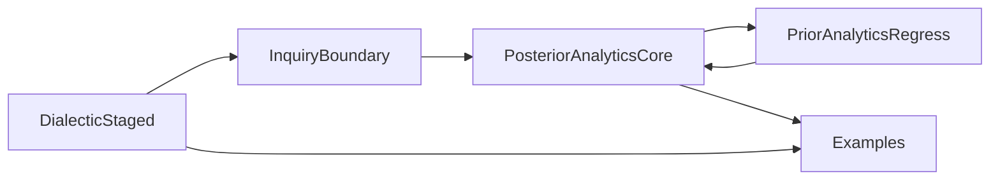

# Menn-Smith Frontier Roadmap

## Core Idea
Build the next phase around theorem families that make the current architecture more informative, not merely larger:

The strongest next gains are:
- Menn: turn staged diagnosis into a real metatheory of admissibility vs refutation, and systematically block illicit promotion from dialectical defeat to scientific definition.
- Smith: push `UniqueMiddleIn` and `CompanionCausalRouteIn` into stronger causal/selective theorems, then connect proof-theoretic premise regress to demonstrative expansion and minimal basis.
- Defer heavier global infrastructure again unless one of these phases actually forces it.

## Key Anchors
- [Philosophy/Aristotle/InquiryBoundary.lean](Philosophy/Aristotle/InquiryBoundary.lean): `problemWhyQuestion?`, `NaiveScientificPromotionIn`, `not_naiveScientificPromotionIn_of_definitionFigureOfSpeechMismatch`
- [Philosophy/Aristotle/DialecticStaged.lean](Philosophy/Aristotle/DialecticStaged.lean): `DefinitionDiagnosis`, `diagnoseDefinition`, `DefinitionRefutationByFigureOfSpeechMismatch`, `ThesisStage`
- [Philosophy/Aristotle/Categories.lean](Philosophy/Aristotle/Categories.lean): `DialecticalDefinitionDossier.not*`, `FigureOfSpeechMismatch`, screening and categorial dossier APIs
- [Philosophy/Aristotle/PosteriorAnalytics/Core.lean](Philosophy/Aristotle/PosteriorAnalytics/Core.lean): `UniqueMiddleIn`, `CompanionCausalRouteIn`, `DemonstrativeExpansionIn`, `MinimalDemonstrativeBasisIn`
- [Philosophy/Aristotle/PriorAnalytics/Regress.lean](Philosophy/Aristotle/PriorAnalytics/Regress.lean): `PremiseExpansion`, `ExpansionWitness`, disciplined regress steps
- [Philosophy/Aristotle/Examples/Dialectic.lean](Philosophy/Aristotle/Examples/Dialectic.lean) and [Philosophy/Aristotle/Examples/Demonstration.lean](Philosophy/Aristotle/Examples/Demonstration.lean): keep each tranche witnessed by non-toy examples

## Phase 1: Menn Metatheory
Use the existing `figureOfSpeechMismatch` anti-promotion theorem as the prototype and close the full family.

Deliver:
- Theorem family in [Philosophy/Aristotle/InquiryBoundary.lean](Philosophy/Aristotle/InquiryBoundary.lean) saying each staged definition refutation arm blocks `NaiveScientificPromotionIn`, not only `figureOfSpeechMismatch`.
- Soundness/completeness-style API in [Philosophy/Aristotle/DialecticStaged.lean](Philosophy/Aristotle/DialecticStaged.lean): admissible diagnosis iff dossier, and refuted diagnosis implies the corresponding `DefinitionRefutationBy*` witness under the existing priority order.
- Example upgrades in [Philosophy/Aristotle/Examples/Dialectic.lean](Philosophy/Aristotle/Examples/Dialectic.lean) showing multiple distinct defeat modes now block scientific promotion.

Why this is first:
- It makes the dialectical side philosophically sharper without inventing new ontology.
- It turns the current staged API into a real manual of test-and-refutation, closer to Menn’s reading of the Categories/Topics boundary.

## Phase 2: Smith Causal Selectivity
Exploit the new `UniqueMiddleIn` and `CompanionCausalRouteIn` rather than leaving them as light wrappers.

Deliver:
- A new figured-level uniqueness predicate in [Philosophy/Aristotle/PosteriorAnalytics/Core.lean](Philosophy/Aristotle/PosteriorAnalytics/Core.lean), likely `UniqueExplanatoryMiddleIn` or `UniqueCausalMiddleIn`, with Barbara reduction to `UniqueMiddleIn` and explicit second-figure companion theorems.
- Converse or near-converse theorems for second figure: under explicit hypotheses, `CausalExplanatorySyllogismIn` for Cesare/Camestres factors through the companion route rather than merely admitting it as one construction.
- Demonstration examples in [Philosophy/Aristotle/Examples/Demonstration.lean](Philosophy/Aristotle/Examples/Demonstration.lean) upgraded from example-local uniqueness to reusable causal uniqueness.

Why this is second:
- It deepens the central Smith claim that science selects the right middle, not merely any valid derivation.
- It converts the current companion-route API from sufficiency-only into a stronger philosophical statement about second-figure causality.

## Phase 3: Regress/Demonstration Bridge
Unify the proof-theoretic and demonstrative stories across Prior and Posterior Analytics.

Deliver:
- Bridge theorems between `PremiseExpansion` in [Philosophy/Aristotle/PriorAnalytics/Regress.lean](Philosophy/Aristotle/PriorAnalytics/Regress.lean) and `DemonstrativeExpansionIn` / `ExpansionReachableIn` in [Philosophy/Aristotle/PosteriorAnalytics/Core.lean](Philosophy/Aristotle/PosteriorAnalytics/Core.lean).
- General minimal-basis theorems lifting patterns now confined to [Philosophy/Aristotle/Examples/Demonstration.lean](Philosophy/Aristotle/Examples/Demonstration.lean) into the core API, so `MinimalDemonstrativeBasisIn` is no longer mainly example-proved.
- Optional use of `Relation.ReflTransGen` already present in the repo to make the expansion/regress bridge theorem-family stable under multi-step reachability.

Why this is third:
- It creates a genuinely new insight: the same formal middle can be studied simultaneously as a regress step and as a demonstrative expansion.
- It uses Lean/mathlib to make the Analytics layers cohere, instead of leaving them as parallel files.

## Phase 4: Optional Menn SE 22 Expansion
Treat this as conditional on phases 1-3 landing cleanly.

Deliver:
- Generalize the current surface-trap machinery beyond the active/passive action-affection case, likely by replacing the single `SurfaceVoice` axis with a richer but still disciplined `SurfaceTrap` API in [Philosophy/Aristotle/Categories.lean](Philosophy/Aristotle/Categories.lean).
- Thread the richer trap family through staged diagnosis and, if it stays source-tight, connect blocked screening to the answerer-guidance layer in [Philosophy/Aristotle/DialecticStaged.lean](Philosophy/Aristotle/DialecticStaged.lean).

Guardrail:
- Do not start here unless the earlier theorem families are done; this is the most design-sensitive tranche and easiest place to outrun the texts.

## Evaluation Rule
Do not introduce a global `Science`-extension relation or well-founded priority/support layer unless Phase 2 or 3 produces a theorem that clearly wants it. For now, prefer theorem packaging over fresh infrastructure.

## Verification
After each phase:
- extend the existing example files, not standalone toy files
- rebuild the relevant Aristotle targets with `lake build`
- sync [Philosophy/Aristotle/ARCHITECTURE.md](Philosophy/Aristotle/ARCHITECTURE.md), [Philosophy/Aristotle/SOURCE_MAP.md](Philosophy/Aristotle/SOURCE_MAP.md), and the existing review canvas
- record explicitly what became source-grounded and what remains open