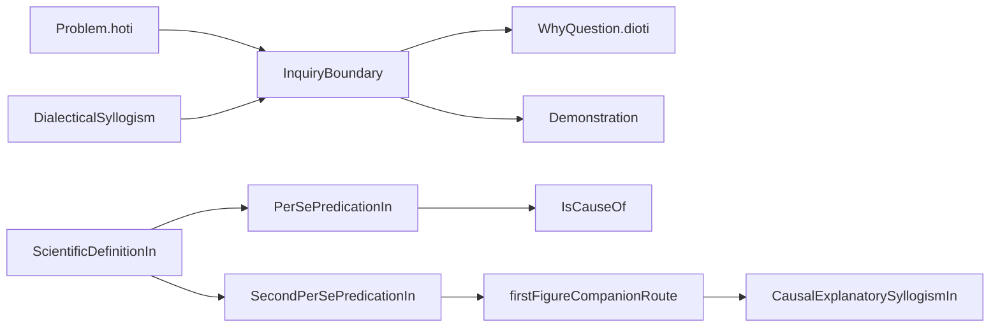

# Menn-Smith Theorem Roadmap

This roadmap treats your request as a **multi-tranche program**, not a single patch. The ordering is deliberate: first make the existing non-collapse claims explicit and reusable; then deepen the Menn-facing dialectical side; then strengthen the Smith-facing demonstrative side.

## Phase 1: Boundary API (shared Menn/Smith payoff)

Create a small bridge module, likely `[Philosophy/Aristotle/InquiryBoundary.lean](Philosophy/Aristotle/InquiryBoundary.lean)`, importing `[Philosophy/Aristotle/DialecticStaged.lean](Philosophy/Aristotle/DialecticStaged.lean)` and `[Philosophy/Aristotle/PosteriorAnalytics/Core.lean](Philosophy/Aristotle/PosteriorAnalytics/Core.lean)`.

Use the current anchors that already exist but are only local:
- `Problem.aim = .hoti` in `[Philosophy/Aristotle/DialecticStaged.lean](Philosophy/Aristotle/DialecticStaged.lean)`
- `WhyQuestion.aim = .dioti` in `[Philosophy/Aristotle/PosteriorAnalytics/Core.lean](Philosophy/Aristotle/PosteriorAnalytics/Core.lean)`
- `DialecticalSyllogism` near the end of `[Philosophy/Aristotle/DialecticStaged.lean](Philosophy/Aristotle/DialecticStaged.lean)`
- `Demonstration`, `AnswersWhyIn`, and `CausalExplanatorySyllogismIn` in `[Philosophy/Aristotle/PosteriorAnalytics/Core.lean](Philosophy/Aristotle/PosteriorAnalytics/Core.lean)`

Deliverables:
- named aim-incompatibility theorems (`Problem` vs `WhyQuestion`)
- a “same categorical content, different inquiry role” bridge using `Problem.statement?` and `WhyQuestion.ofConclusion`
- a strictness API showing that dialectical success and demonstrative/causal success are different achievements, stated under explicit hypotheses rather than as an over-general impossibility theorem
- import update in `[Philosophy/Aristotle.lean](Philosophy/Aristotle.lean)` and example witnesses in `[Philosophy/Aristotle/Examples/Dialectic.lean](Philosophy/Aristotle/Examples/Dialectic.lean)` or `[Philosophy/Aristotle/Examples/Demonstration.lean](Philosophy/Aristotle/Examples/Demonstration.lean)`

## Phase 2: Menn tranche (dialectical insufficiency and refutation)

Deepen the dialectical side where the current code is strongest but still asymmetric.

Targets:
- extend `DefinitionDiagnosis` / `diagnoseDefinition` in `[Philosophy/Aristotle/DialecticStaged.lean](Philosophy/Aristotle/DialecticStaged.lean)` so `SE` 22-style figure-of-speech mismatch is preserved for definition dossiers as well as genus dossiers
- add a bridge theorem showing that a staged `figureOfSpeechMismatch` defeat blocks any naive promotion from a dialectical definition dossier to a scientific-definition style result
- keep this grounded in the current Menn materials already cited in `[Philosophy/Aristotle/ARCHITECTURE.md](Philosophy/Aristotle/ARCHITECTURE.md)` and `[Philosophy/Aristotle/SOURCE_MAP.md](Philosophy/Aristotle/SOURCE_MAP.md)`, without yet widening all of `SE` 22’s category-confusion families

Likely files:
- `[Philosophy/Aristotle/Categories.lean](Philosophy/Aristotle/Categories.lean)`
- `[Philosophy/Aristotle/DialecticStaged.lean](Philosophy/Aristotle/DialecticStaged.lean)`
- `[Philosophy/Aristotle/Examples/Dialectic.lean](Philosophy/Aristotle/Examples/Dialectic.lean)`
- `[Philosophy/Aristotle/InquiryBoundary.lean](Philosophy/Aristotle/InquiryBoundary.lean)`

## Phase 3: Smith tranche (make the current posterior gains reusable)

Take the current posterior example results and turn them into a reusable theorem/API layer.

Targets:
- make `[Philosophy/Aristotle/PosteriorAnalytics/Core.lean](Philosophy/Aristotle/PosteriorAnalytics/Core.lean)` use `SecondPerSePredicationIn` more explicitly in the companion-based causal story, so it is not merely recorded beside the causal API
- package middle-selectivity results now living only in `[Philosophy/Aristotle/Examples/Demonstration.lean](Philosophy/Aristotle/Examples/Demonstration.lean)` (for example the mortality/negative-companion uniqueness patterns) into a small reusable predicate or theorem family in `PosteriorAnalytics`
- add companion-route bridge theorems for second-figure cases so `Cesare`/`Camestres` causal answers are visibly inherited from the perfected first-figure route, not only by example construction

Likely files:
- `[Philosophy/Aristotle/PosteriorAnalytics/Core.lean](Philosophy/Aristotle/PosteriorAnalytics/Core.lean)`
- `[Philosophy/Aristotle/PriorAnalytics/ProofTheory.lean](Philosophy/Aristotle/PriorAnalytics/ProofTheory.lean)`
- `[Philosophy/Aristotle/Examples/Demonstration.lean](Philosophy/Aristotle/Examples/Demonstration.lean)`

## Phase 4: Heavier infrastructure only if phases 1-3 land cleanly

This phase should be treated as optional but desirable, because it likely needs new abstractions rather than theorem packaging alone.

Candidates:
- a `Science`-extension relation supporting a conservative-refinement theorem: adding per-se/causal structure refines explanatory status without changing old `TrueIn` facts
- a priority / well-founded support relation to upgrade local anti-reciprocity into a more global Smith-facing account of basis and regress termination

If this phase turns out to require too much new machinery, defer it rather than muddy phases 1-3.

## Verification and docs

After each tranche:
- extend the relevant example file rather than adding isolated toy proofs
- update `[Philosophy/Aristotle/ARCHITECTURE.md](Philosophy/Aristotle/ARCHITECTURE.md)` and `[Philosophy/Aristotle/SOURCE_MAP.md](Philosophy/Aristotle/SOURCE_MAP.md)` to state exactly what is now source-grounded and what remains open
- keep the review artifact in the existing canvas aligned with the live code state
