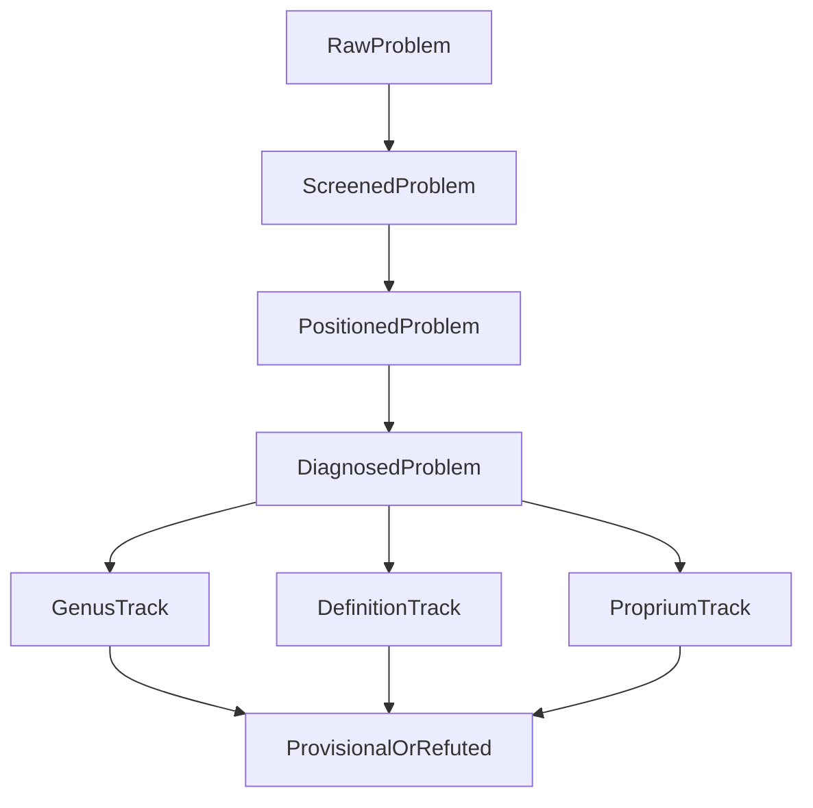

# Menn Dialectic Tranche

## Focus

- Extend the current balanced Menn layer from genus screening into fuller dialectical testing of genus, proprium, and dialectical definition.
- Keep [Philosophy/Aristotle/Core.lean](Philosophy/Aristotle/Core.lean) as the only kernel, and keep scientific definition in [Philosophy/Aristotle/PosteriorAnalytics/Core.lean](Philosophy/Aristotle/PosteriorAnalytics/Core.lean) distinct from weaker dialectical definition.

## Current Pressure Points

- [Philosophy/Aristotle/DialecticStaged.lean](Philosophy/Aristotle/DialecticStaged.lean) already distinguishes `.genus`, `.definition`, and `.proprium`, but only genus gets a real positioned-and-diagnosed path.
- [Philosophy/Aristotle/Categories.lean](Philosophy/Aristotle/Categories.lean) provides category placement, idia, contraries, and more/less checks, but does not yet package them into reusable definition/proprium workflows.
- [Philosophy/Aristotle/Core.lean](Philosophy/Aristotle/Core.lean) already has the right predicational vocabulary, but the Menn layer is not consuming it yet.

```172:179:Philosophy/Aristotle/Core.lean
class Predication (B : Type) where
  said_of : B → B → Prop
  in_subject : B → B → Prop
  genus_of : B → B → Prop
  species_of : B → B → Prop
  differentia_of : B → B → Prop
  proprium_of : B → B → Prop
```

```233:243:Philosophy/Aristotle/DialecticStaged.lean
inductive ThesisStage [Manual]
  | raw (problem : Problem)
  | screened (problem : ScreenedProblem)
  | positioned (problem : PositionedProblem)
  | provisionalGenus (problem : ProvisionalGenus)
  | refutedByCategoryMismatch (problem : PositionedGenusProblem)
      (h : ¬ sameCategory problem.subject problem.genusTerm)
  | refutedByContraryMismatch (problem : PositionedGenusProblem)
      (h : GenusRefutationByContraryMismatch problem.subject problem.genusTerm)
```

## Proposed Shape




## Work Plan

1. Enrich [Philosophy/Aristotle/Categories.lean](Philosophy/Aristotle/Categories.lean).

- Add reusable dossier types over `PositionedCandidate` for dialectical genus, proprium, and definition checks.
- Keep category placement primary, then layer Menn-style checks such as same-category, idia, contrary, and more/less constraints.
- Represent dialectical definition as a weaker, test-oriented structure rather than a scientific essence claim.

1. Generalize staged diagnosis in [Philosophy/Aristotle/DialecticStaged.lean](Philosophy/Aristotle/DialecticStaged.lean).

- Extend the genus-only staged path with `DefinitionDiagnosis` and `PropriumDiagnosis` (or a uniform diagnosis API with named constructors).
- Refactor `ThesisStage` so `.definition` and `.proprium` can progress through `screened -> positioned -> diagnosed -> provisional/refuted`, not just stop at syntactic tagging.
- Prefer explicit refutation reasons over booleans or lossy `Option` returns.

1. Bridge the Menn layer to [Philosophy/Aristotle/Core.lean](Philosophy/Aristotle/Core.lean) without creating a second foundation.

- Introduce an optional extension over `Manual` that interprets `Predication.genus_of`, `differentia_of`, and `proprium_of` for dialectical lemmas.
- Add theorem helpers connecting those relations to `isSaidOf`, `isInSubject`, `sameCategory`, `supportsOpposition`, `hasContrary`, and `admitsMoreAndLess`.

1. Raise regression and documentation fidelity.

- Expand [Philosophy/Aristotle/Examples/Dialectic.lean](Philosophy/Aristotle/Examples/Dialectic.lean) with one dialectical-definition case and one proprium case in addition to the existing soul/harmony genus refutation.
- Update [Philosophy/Aristotle/SOURCE_MAP.md](Philosophy/Aristotle/SOURCE_MAP.md) and [Philosophy/Aristotle/ARCHITECTURE.md](Philosophy/Aristotle/ARCHITECTURE.md) so the documented Menn coverage matches the new workflow.

## Validation

- Typecheck the new example module directly and rebuild [Philosophy/Aristotle.lean](Philosophy/Aristotle.lean) and [Philosophy.lean](Philosophy.lean).
- Treat the new examples as regression theorems over the public API rather than isolated sketches or axiom-heavy demos.

