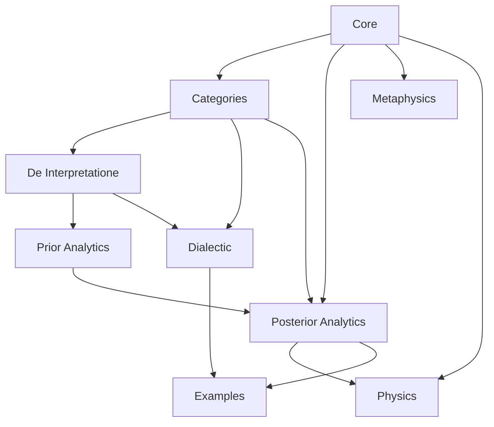

# Aristotle Architecture

## Overview

The Aristotle folder is now organized around one shared kernel rather than
three partially overlapping mini-foundations.

## Design Constitution

The current architecture is governed by five non-collapse rules.

- Do not collapse simple `Term` and combined definiens.
- Do not collapse dialectical definition and scientific definition.
- Do not collapse primary substance and secondary substance.
- Do not collapse valid syllogism and explanatory demonstration.
- Do not collapse ontological being and truth-in-thought.

## Governing Sources

The general guide for the subtree is `Philosophy/Aristotle/Aristotle.md`
(Stephen Menn's encyclopedia entry). It fixes the large pedagogical and
disciplinary ordering:

- dialectic is preliminary and test-oriented rather than already scientific
- analytics must distinguish valid syllogism from explanatory demonstration
- first philosophy and physics are downstream theoretical sciences with
  different subject matters
- the corpus should be organized by role in inquiry, not merely by title order

That general guide is then thickened locally by the more detailed
reconstructions already in the repo:

- `Philosophy/Aristotle/MDC_Menn.md` for the Categories/Topics/dialectic layer
- `Philosophy/Aristotle/H. Weidemann - De Interpretationae.md` for the
  contradiction-and-dialectic reading of `De Interpretatione`, used here under
  Whitaker's governing interpretation
- `Philosophy/Aristotle/Topics-I.1.md` through `Topics-I.16,17,18.md` for
  Smith's translation and commentary on the architecture of dialectical method:
  endoxa, problems, theses, predicables, categories, collection of premisses,
  many-ways-said, differences, likenesses, and locations
- `Philosophy/Aristotle/Topics-VIII.1.md` through `Topics-VIII.14.md` for
  Smith's translation and commentary on arrangement, concealment,
  questioner/answerer norms, objections, criticism, and training
- `Philosophy/Aristotle/AOMSB1.md` for Δ7, actuality, and truth-in-thought
- `Philosophy/Aristotle/Path to Principles.md` for Physics I Reading B
- `Philosophy/Aristotle/Menn_AimAndArgument_Map.md` for how in-repo *Aim and
  Argument* PDFs (`I*`, `II*`, `IIIa2`) relate to the Lean map without conflating
  Menn’s programmes (Physics path, D7/EZHQ, dialectic, Δ *archai* vocabulary)
- the `Philosophy/Aristotle/R.Smith*.md` corpus for syllogistic semantics,
  immediacy, regress, and demonstration

Accordingly, source guidance should be dispersed rather than centralized:

- docs state architectural role and current adequacy
- module headers state which source-function governs the file
- key structures and comments record the distinction they are designed to carry
- examples witness the positive and negative cases of the reconstruction

For the current dialectical subtree, the source-led division is:

- `Topics` Book I governs the classification of materials
- `Topics` Book VIII governs the deployment of those materials in exchange
- Menn's `MDC_Menn.md` governs how those Aristotelian materials should be read
  as a philosophically serious pre-scientific discipline rather than as a mere
  eristic handbook

## Canonical Homes

| Concept | Canonical home | Notes |
| --- | --- | --- |
| `Lexis`, `Term`, `Signified`, `Logos`, `Expression` | `Philosophy/Aristotle/Core.lean` | Shared linguistic and ontological kernel, now tokenized rather than raw-string-backed |
| `DefinitionalPhrase`, `DefinitionKind` | `Philosophy/Aristotle/Core.lean` | Shared definition-side vocabulary; screened and scientific refinements live downstream |
| `Category`, `Predicable`, `OppositionKind` | `Philosophy/Aristotle/Core.lean` | No duplicate `Category` definitions remain |
| Signification, paronymy, predication, essence, causes | `Philosophy/Aristotle/Core.lean` | Cross-domain abstractions; morphology is quiver-backed and genus/species location is order-backed without collapsing `in_subject` into that order |
| Antepredicamental screening, category placement, Menn dossiers, and surface-trap checks | `Philosophy/Aristotle/Categories.lean` | Genus, dialectical-definition, proprium, and `SE` 22-style surface-trap / figure-of-speech checks live here; genus-plus-differentia and substance-rank refinements remain active work |
| Optional bridge from unary manual tests to `Core.Predication` | `Philosophy/Aristotle/Categories.lean` | `PredicationalManual` and helper lemmas |
| Assertoric statement-types and contradictory pairing | `Philosophy/Aristotle/DeInterpretatione.lean` | Statement-side layer between term classification and syllogistic; it now tracks indefinite, many-as-one, negated-term, and singular future-contingent assertoric cases, while modal and DI 11 refinements remain pending |
| Syllogistic syntax and proof theory | `Philosophy/Aristotle/PriorAnalytics/*.lean` | Prior Analytics layer, explicitly narrowed from the `DeInterpretatione` categorical fragment |
| Science-relative truth, immediacy, why-question, causal why-answer, and demonstration | `Philosophy/Aristotle/PosteriorAnalytics/*.lean` | Smith layer; figured middle-selectivity, companion-route factorization, and regress/demonstration bridge theorems now live here, while richer figure-specific bridges and reciprocity refinements remain active work |
| Whether/why bridge and non-collapse boundary API | `Philosophy/Aristotle/InquiryBoundary.lean` | Explicitly separates dialectical `hoti` problems from demonstrative `dioti` questions while allowing the same categorical sentence to be re-asked under a different inquiry role |
| D7 axes of being | `Philosophy/Aristotle/SensesOfBeing.lean` | Truth moved to a thought-layer; the thought/being interface is still being refined |
| Path to principles | `Philosophy/Aristotle/PhysicsI.lean` | Reading B is canonical |
| Menn cross-map (Reading B as order; pointers to three non-collapse axes) | `Philosophy/Aristotle/MennAlignment.lean` | Exposes mathlib `PartialOrder`/`BoundedOrder` on `DescriptionStage`, a `descriptionStage_le_total` witness (2-point orders are linear), and thin lemmas from `PathToPrinciples`; no bundled `LinearOrder` (min/max/compare) to keep the 2-type light; does **not** replace `PhysicsI.lean`, `InquiryBoundary.lean`, or `SensesOfBeing.lean` |
| Legacy Physics I names | `Philosophy/Aristotle/PhysicsI_Principles.lean` | Compatibility facade only |
| Local cause coincidence | `Philosophy/Aristotle/PhysicsII_Causes.lean` | No global reduction class |

## Layer Summary

- `Core`: shared vocabulary for expression, signification, predication, causes,
  and per-se/per-accidens structure, plus neutral definition-side vocabulary.
  Its lexical carriers are now tokenized lists, its morphology interface is
  quiver-shaped, and its genus/species hierarchy is carried by a partial order
  while `said_of` and `in_subject` remain dialectically distinct relations.
- `Categories`: resolves terms into referent-plus-logos candidates and then
  places those candidates categorically; it also packages Menn-style genus,
  definition, and proprium dossiers, plus an optional relational bridge to
  `Core.Predication`. The current refinement front strengthens dialectical
  definition into an explicit genus-plus-differentia path, separates primary
  from secondary substance, and now tracks a broader `SurfaceTrap` family in
  which grammatical voice is one source-guided case: active surface appearance
  can still suggest `poiein` although categorial placement resolves the term
  under `paschein`, but the trap layer is no longer hard-wired to that one
  axis alone.
- `DeInterpretatione`: introduces the statement-side layer missing between term
  classification and the later syllogistic restriction, with assertoric
  statement-types, contradiction, typed RCP-exception tracking for `DI` 7-10,
  and an explicit bridge to the categorical fragment.
- `Dialectic`: stages raw theses into screened and positioned problems and now
  exposes explicit provisional/refuted outcomes for genus, definition, and
  proprium problems while still managing concessions through available endoxa.
  Its `Problem` API is now explicitly `hoti`-oriented: it asks whether a claim
  stands, not yet why it stands. The current Menn-facing tranche also lets
  `SE` 22-style figure-of-speech mismatches feed directly into both genus and
  definition diagnosis: active surface appearance can now force a dedicated staged
  `figureOfSpeechMismatch` refutation rather than being collapsed into an
  ordinary `categoryMismatch`; the staged API now also exposes
  admissible/refuted characterization theorems for definition diagnosis and a
  broader surface-trap layer that blocks provisional screening and admissible
  definition diagnosis even beyond the current voice-specific cases.
- `InquiryBoundary`: packages the shared non-collapse theorems between staged
  dialectic and Posterior Analytics. It gives a small bridge from
  `Problem.statement?` to `WhyQuestion.ofConclusion`, makes the `hoti`/`dioti`
  aim boundary explicit, and records that dialectical success, demonstrative
  basis, and causal why-answer are distinct achievements rather than one flat
  notion of "inquiry success." The anti-promotion side is now a full family:
  every staged definition-refutation arm, plus the broader surface-trap
  generalization, blocks naive elevation from dialectical defeat to scientific
  definition.
- `PriorAnalytics`: keeps the syllogistic restriction and proof theory separate
  from both the broader `DeInterpretatione` statement layer and the semantic
  chain layer.
- `PosteriorAnalytics`: indexes truth, immediacy, and demonstration by a
  `Science`, not by bare propositions alone. The current refinement front
  strengthens explanatory middle and non-reciprocity so demonstration is not
  reduced to validity plus labels; it now also exposes explicit `WhyQuestion`
  / `AnswersWhyThroughCauseIn` and `DemonstrativeBasisIn` layers so Smith's
  distinction between a valid syllogism, an explanatory answer, a causal
  answer, and a first-principled basis is visible in the type structure. The
  `dioti` side is no longer Barbara-only: both the explanatory witness and the
  one-step expansion / anti-reciprocity layer now cover the currently modeled
  universal negative moods as well, immediacy for universal negatives is now
  tracked by explicit figure-sensitive middle exclusions rather than by a flat
  fallback notion alone, and the causal layer is no longer a free tag: it now
  requires a perfected first-figure route together with a
  `PerSePredicationIn` witness from scientific definition on the minor premise
  and a first-principled major premise. The second per-se kind is now tracked
  separately as `SecondPerSePredicationIn`, and second-figure causal answers are
  routed through `firstFigureCompanion` rather than treated as immediately
  causal in their surface form; the current API now also exposes
  `UniqueMiddleIn`, `UniqueExplanatoryMiddleIn`, and `UniqueCausalMiddleIn` for
  middle-selectivity at different explanatory strengths, plus
  `CompanionCausalRouteIn` for the explicitly second-per-se route by which
  Cesare/Camestres inherit causal force from their perfected first-figure
  companion. It also now bridges Prior and Posterior Analytics explicitly:
  demonstrative one-step expansion yields a singleton-stock `PremiseExpansion`
  witness, and minimal demonstrative basis can be constructed in core from
  basis plus irredundancy rather than only by example-local record assembly.
- `Metaphysics` and `Physics`: downstream domain modules over the shared core.
- `MennAlignment`: a thin consolidation layer (not a fourth science) that
  makes Menn’s **analogies** between Reading B, scientific ὅτι/διότι order, and
  Δ7-style “many senses of being” explicit in documentation and in a few
  mathlib order instances on `DescriptionStage`, while the substantive APIs stay
  in `PhysicsI.lean`, `InquiryBoundary.lean`, and `SensesOfBeing.lean` respectively.

## Current Refinement Front

- `Core` now carries both the neutral `DefinitionalPhrase` and the explicit
  typed split `DialecticalDefinition` / `ScientificDefinition`.
- `Core` now treats lexical items and accounts as token-sequences rather than
  raw strings, and it interprets genus-plus-differentiae composition through a
  `SemilatticeInf` meaning operation instead of ad hoc string concatenation.
- `Categories` and `Dialectic` now treat definition-problems explicitly as
  dialectical definitions rather than as an undifferentiated phrase-object.
- `DialecticStaged` now marks dialectical `Problem`s as explicitly `hoti`
  questions, making Menn's whether/why boundary more visible in the API.
- `Categories` now sits over the new quiver/order infrastructure: paronymy is
  still linguistic, genus-location is still dialectical, and neither is allowed
  to collapse into causal science.
- `Categories` now also carries a generalized `SurfaceTrap` layer so Menn's
  `SE` 22 cases can be expressed without confusing grammatical appearance with
  genuine categorial placement; `SurfaceVoice` is now one disciplined source of
  those traps rather than the whole API.
- `DialecticStaged` now preserves that `SE` 22 reason at the diagnosis layer:
  a sophism driven by misleading grammatical voice is not flattened into a
  merely generic categorial failure, and that now holds for definition dossiers
  as well as genus dossiers. Its definition-diagnosis API now also has
  admissible-iff-dossier and priority-sensitive refutation characterizations,
  while the broader `SurfaceTrapMismatch` layer blocks provisional genus
  screening and admissible definition diagnosis.
- `InquiryBoundary` now makes the hoti/dioti boundary public: a dialectical
  `Problem` can be re-asked as a `WhyQuestion` with the same categorical
  content, but the inquiry-role changes, and dialectical success does not by
  itself amount to demonstrative or causal success. The full anti-promotion
  family is now public as well: category, contrary, degree, genus, differentia,
  in-subject, figure-of-speech, and generalized surface-trap defeat all block
  naive scientific promotion.
- `DeInterpretatione` now provides a first explicit statement-side layer, so
  contradiction is no longer carried only implicitly by the later categorical
  syntax; the current tranche now extends that layer through `DI` 7-10 with
  negated-term carriers, many-as-one irregularity, and singular
  future-contingent exception-typing.
- Smith's `Topics` Book I and Book VIII files now provide the chapter-by-chapter
  control text for that refinement, especially around endoxa/problem/thesis on
  the one side and arrangement/objection on the other.
- `PosteriorAnalytics` now has an explicit `ScientificDefinitionIn` object for
  first-principled scientific definition, and it now also has explicit
  `WhyQuestion` / `DemonstrativeBasisIn` notions for explanatory targets and
  first-principled support. Its explanatory witness and expansion relation are
  now figured rather than merely Barbara-specific, so universal negative
  `why`-answers, negative anti-reciprocity cases, and a full negative
  demonstration can already be represented; it now also has a distinct
  `PerSePredicationIn` / `SecondPerSePredicationIn` / `IsCauseOf` /
  `CausalDemonstration` layer for cases where the middle is explicitly taken as
  cause in a definition-grounded way. The current causal layer still treats
  first-figure perfection as canonical, but second-figure cases can now be
  carried causally through their perfected companion rather than being left
  entirely outside the causal API; `CompanionCausalRouteIn` now exposes that
  route as a reusable theorem object, `UniqueExplanatoryMiddleIn` /
  `UniqueCausalMiddleIn` lift middle-selectivity to figured explanatory and
  causal settings, and the Prior/Posterior bridge now packages each
  demonstrative expansion as a corresponding singleton-stock `PremiseExpansion`
  witness while `Demonstration.minimalBasis` lifts minimal-basis construction
  out of local examples.
- A heavier `Science`-extension relation or global priority/well-founded support
  layer has now been evaluated and deliberately deferred. After the current
  boundary, Menn, and Smith tranches, the existing APIs already express the
  relevant non-collapse claims without introducing a second infrastructure that
  would currently have no source-grounded examples to justify it.
- `SensesOfBeing` already separates truth from flat categorial enumeration, but
  it is still being revised so truth remains in thought without anti-realist
  drift about the objects thought is about.
- the next source-led steps are to deepen the `DeInterpretatione` layer through
  `DI` 11-13, populate the now-general Menn-side `SurfaceTrap` family with more
  source-grounded cases and only then decide whether it should inform the
  answerer-guidance layer, and deepen Smith's side beyond the current
  universal-mood tranche with richer figure-bridges and stronger
  regress-sensitive reciprocity. A separate `Science`-extension or global
  priority layer should wait until those richer examples force it.

## Migration Notes

- `Philosophy/Aristotle/Basic.lean` is now a thin compatibility prelude over
  `Core`.
- `Philosophy/Aristotle.lean` is the public Aristotle root module.
- `Philosophy.lean` imports the Aristotle root rather than listing internal
  files one by one.
